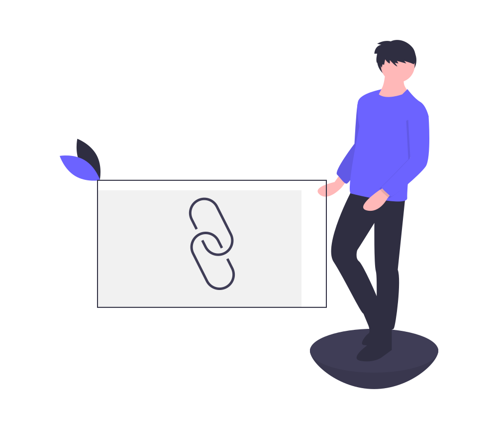

<p align="center">
  
</p>
<h1 align="center">URL Shortner</h1>

<h4 align="center">
  URL Shortener using PHP with MySQL &amp; JavaScript
</h4>

### Description
<p align="justify">
 It creates a short url of your long url which is a maximum of 5 characters. URL shortener is a service that helps take longer URLs (which can be over a hundred characters long) and transform them into manageable links that rarely exceed 20 characters. The user simply have to enter the URL into the textbox provided. Once the text is inserted, a button will appear. The user can then simply click on the button to generate the URL. If the URL inserted is not a validURL the system will prompt an error message about the URL. Also the system will keep track of the number of clicks on the links. The user will also be provided with the list of all the links which he/she can delete by simply clicking on the delete button.<br>
 Initially there will be no button, but the button will appear once the text is inserted, also the border and the textbox will change its color to show the active starte of the system. If the URL already exists then the system will simply stop the system processing and will prompt the user to change the URL because the current already exists. <br>
 The app simply asks the user to insert certain kind of URL. Once th URL is inserted, then the validation is implemented, whether the inserted URL is valid or not or is it empty. Once the URL is validated, then a series of random characters is generated at the backend that is going to be used as a URL. Then the user have been provided with the authority to handle the operation of vhanging the shortned URL. Then press the save btn to save it to the database. Once the link is added then the no of clicks value will be updated. Also, if the user clicks on the shortened URL then the no of clicks will be updated automatically. The delete operation has been enabled in the table. If the user no longer need the link then the user can simply click on the delete button on the table and the link will be removed from the table as well as the database.<br>
Also, when the URL has been generated and user want to update the URL the it is must that the <strong>domain name must remain the same</strong>, otherwise, the app will display an error message and wont allow the user to create the link instead, the system will automatically save the link from the previously stored randomly generated valued URL. Similarly, same URLs cannot be generated in this app. 
</p>

<br><br>

## Features
<br>
Following are some of the new features and learning encountered while creating this amazing project:

- The button will appear after the form has been validated. Following code has been used for this process.
```
form button{
    transition: all 300ms ease;
    opacity: 0;
    pointer-events: none;
}


form input:valid ~ button{
    opacity: 1;
    pointer-events: auto;
}
```
- Configuring the Database with PHP
- Managing Database in phpmyadmin
- Configuring app to open the shortened URL.
- Does not allow the generation of URL with same shortened URLs
<br><br>

## Resources
<br>
Follwing resources have been used in maintaining this project:

- [Google Fonts](https://fonts.google.com/specimen/Poppins?query=pop#styles) to insert the Poppins Font Family.
- [UnDraw](https://undraw.co/search) to import the logo of the project.
- [0to255](https://0to255.com/#20B2AA) to find the transitioning colors to be used in hover effect.
<br><br>


## Link To Video
<a href="https://youtu.be/iwmg3oQGvo4">Click Here</a> to get access to the video of the project in running state.
<br><br>

## GUI

<br><br>

## Technology Stack
<br>
Follwing technologies have been used at the core of this application to make it stand in the market place:

- HTML
- CSS
- PHP
- MySQL
- Xampp
<br><br>

## Advancement
> The Deployment can be done to make it available for all the users.
<br><br>


## Developer
Muhammad Abdullah Butt <br>
abdullahbutt12292210@gmail.com <br>
> [Instagram](https://www.instagram.com/abdullah.butt.22/)<br>
> [FaceBook](https://www.facebook.com/profile.php?id=100076291614529)<br>
> [YouTube](https://www.youtube.com/channel/UCnuOFQyMywg-KuoN-lmav1Q)<br>
> [Portfolio](https://rebrand.ly/muhammadabdullahPortfolio)<br>
> [Website](#)


